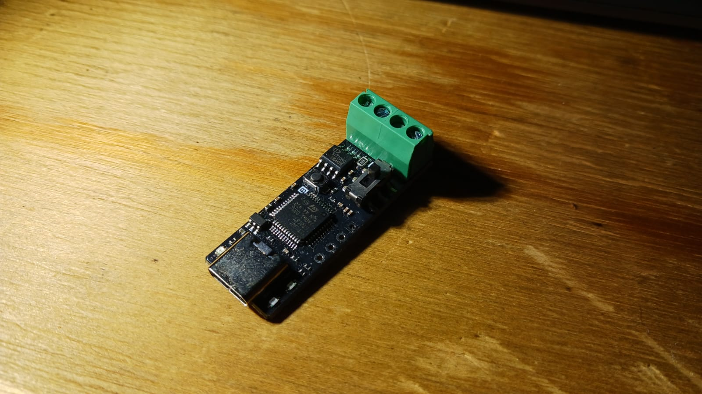

# canable-case

CANable DykbRadio V1.0 Nano case.

There are a lot of CANable dongle formats and I thrive to support as much as possible.
For now without feature requests, I start with supporting the DykbRadio V1.0 nano.

## Purpose

The idea is to integrate the dongle with a DB-9 connector to be compatible with PEAK PCAN dongles.

## My dongle

The design is based on the dongle shown in the following images.

## How to build

Run the `scripts/render_parts.sh` script which requires:
* wget
* unzip
* docker

The BOSL2 library is installed automatically and openscad is used from the docker image.

## How to thank me

All the free effort deserves a cup of coffee

